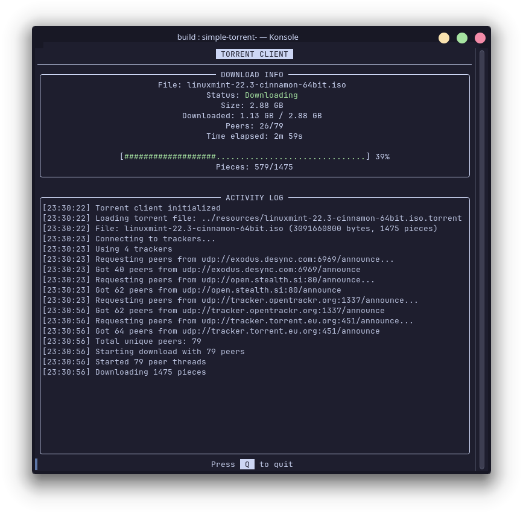
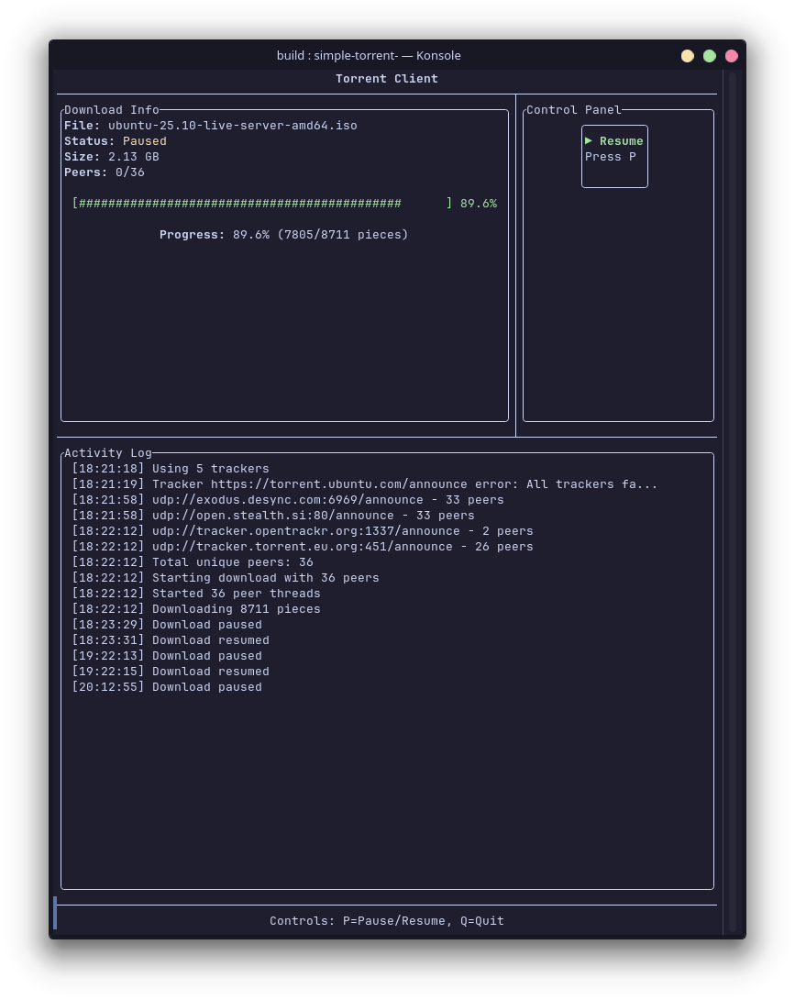
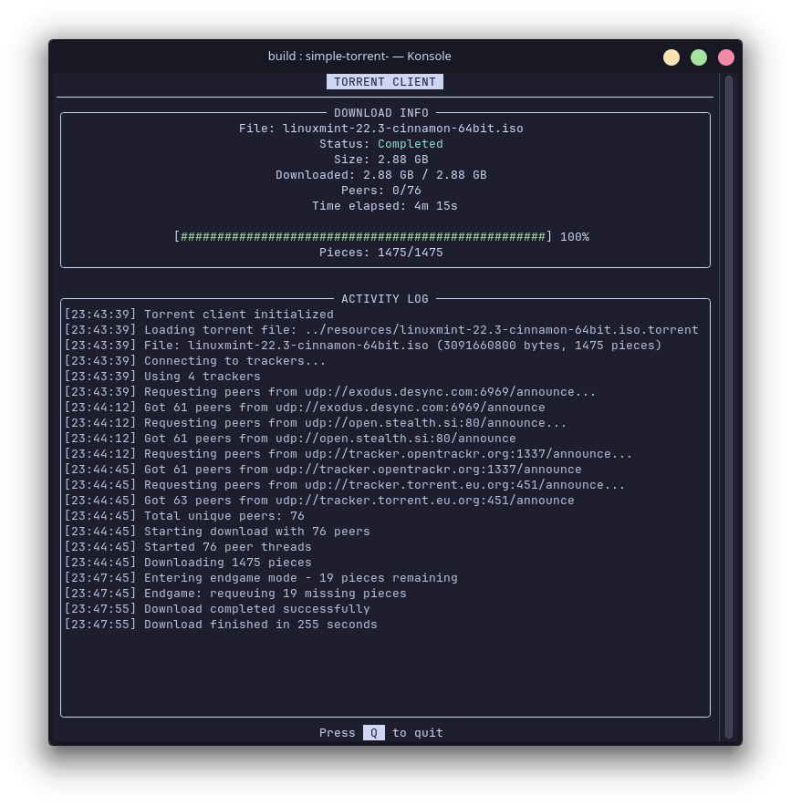

### Torrent-Client

A lightweight C++ BitTorrent client implementation supporting downloads of single-file torrents, using both TCP and UDP trackers. Now has Text User Interface.

This is an old university project of mine which I aim to refactor and enhance.

## Screenshots




## Features
- Single-file torrent downloads
- Multi-threaded peer connections
- Compact peer protocol support
- Text User Interface

## Dependencies
Required
- C++17 compatible compiler
- CMake (3.14 or higher)
- OpenSSL (for SHA-1 hashing)
- libcurl (for HTTP tracker communication)

Downloaded Automatically
- FTXUI - for TUI
- CPR - for network requests

## Dependencies Installation

### Ubuntu/Debian

```bash
sudo apt update
sudo apt install build-essential cmake libssl-dev libcurl4-openssl-dev
```

### Arch Linux
```bash
sudo pacman -S base-devel cmake openssl curl
```

### macOS
```bash
brew install cmake openssl curl
```

## Build
```bash
git clone https://github.com/n3tw4lk3r/Torrent-Client
cd Torrent-Client
mkdir build && cd build
cmake -DCMAKE_EXPORT_COMPILE_COMMANDS=ON ..
make -j$(nproc)

```
## Usage

```bash
# in Torrent-Client/build
# make sure you have output-directory created
src/simple-torrent-tui <torrent-file> <output-directory>
```

### Example

```bash
# in Torrent-Client/build
# downloads is created before executing the command
src/simple-torrent-tui ../resources/ubuntu-25.10-live-server-amd64.iso.torrent downloads
```

## Main Components
- PieceStorage
Manages file pieces and disk storage
- TorrentClient
Main client class coordinating download process
- TorrentTracker
Handles communication with TCP trackers
- UdpTracker
Handles communication with UDP trackers
- PeerConnect
Manages individual peer connections
- TcpConnect
Handles TCP connections
- UdpClient
Handles UDP connections
- BencodeParser
Parses Bencode formatted data

## Limitations
- Supports only single-file torrents (no multi-file/directory structure)
- No seeding/upload capability
- No DHT support
- No magnet link support

## Features To Implement:

### Should do at somewhat near future
- Improve code quality

### Will implement some day
- Multi-file support
- Seeding

